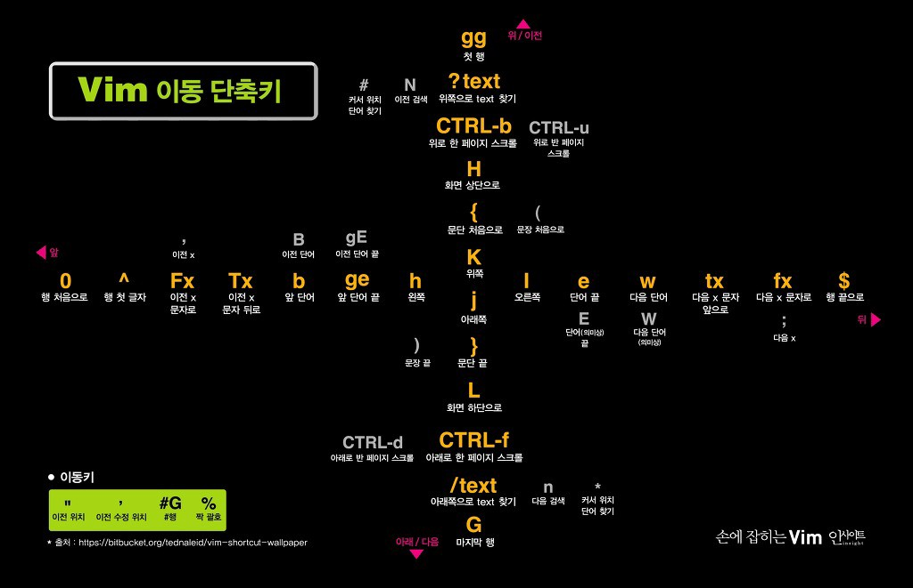

# VIM 정리

## vi / vim 단축키 모음

## VIM 단축키

### 기본 이동
- `i` - 현재 커서에 쓰기
- `a` - 다음 커서에 쓰기
- `I` - 현재 줄 맨앞에 Insert 하기
- `A` - 현재 줄 맨뒤에 Insert 하기
- `o` - 다음줄에 쓰기
- `O` - 윗줄에 쓰기
- `w` - 워드 단위로 앞으로 이동
- `W` - 화이트스페이스 단위로 다음 글자로 이동하기
- `b` - 워드 단위로 뒤로 이동
- `B` - 백워드 방향으로 화이트스페이스 단위로 다음 글자로 이동하기
- `e` - 단어의 마지막 글자로 이동하기
- `ge` - 백워드 방향으로 단어의 마지막 글자로 이동하기
- `gg` - 문서 맨 앞으로 이동
- `G` - 문서 맨끝으로 이동
- `라인넘버G` - 라인번호로 이동
- `0` - 라인 맨 앞으로 이동
- `^` - 현재 줄의 첫번째로 이동
- `$` - 현재 줄의 끝으로 이동
  
### 문단 이동
- `H` - 화면상에서 제일 위로
- `M` - 화면상에서 중간으로 이듕
- `L` - 화면상에서 제일 아래로 이동

### CTRL 사용 이동
- `CTRL + f` - page down
- `CTRL + b` - page up
- `CTRL + u` - page half down
- `CTRL + d` - page half up
- `CTRL + e` - 커서는 그대로 있으면서 화면을 아래로 한줄씩 이동
- `CTRL + y` - 커서는 그대로 있으면서 화면을 위로 한줄씩 이동
- `Ctrl + a` - 숫자를 증가시키기
- `Ctrl + x` - 숫자를 감소시키기
- `CTRL + G` - VIM에서 현재위치와 파일의 상태를 볼 수 있음
- `CTRL + O` - 원래 있던 곳으로 돌아가기
- `CTRL + I` - 다시 뒤로 돌아가기
- `Ctrl + w` - 분할창 간에 이동하기

### 기호 이동
- `]]` - 포워드 방향으로 여는 컬리 블레이스( `{` )로 이동
- `[[` - 백워드 방향으로 여는 컬리 블레이스( `{` )로 이동
- `][` - 포워드 방향으로 닫는 컬리 블레이스( `{` )로 이동
- `[]` - 백워드 방향으로 닫는 컬리 블레이스( `{` )로 이동
- `%` - `{}`나 `()`에서 현재 괄호의 짝으로 이동

### 에디터
- `~` - 커서에 있는 문자의 대소문자 변경
- `"+p` - 클립보드 붙여넣기
- `*p` - ` "vim.useSystemClipboard": true` 설정 후 클립보드 붙여넣기
- `D` - 현재 커서 이후로 한줄 삭제
- `J` - 다음 라인을 현재 줄의 끝으로 이어 붙힘
- `dd` - 현재 줄 잘라내기
- `dw` - 단어 잘라내기
- `yy` - 현재 줄 복사하기
- `p` - 붙여넣기
- `r` - 현재 글자 교체하기
- `R` - 현재 글자 부터 계속 교체하기
- `x` - 현재 글자 지우기
- `X` - 앞의 글자 지우기
- `>` - 들여쓰기
- `<` - 내어쓰기
- `cw` - 단어 잘라내기
- `c$`  - 현재 단어부터 끝까지 지우고 편집모드
- `ce` - 현재 커서에서 부터 단어의 끝까지 지우고 편집모드

### 되돌리기, 다시실행하기, 반복실행
- `u` - Undo
- `Ctrl + r` - Redo
- `.` - 이전 명령어를 다시 실행

### 비쥬얼 모드
- `CTRL + v`: 블럭 Select
- `v` - 비쥬얼모드(비쥬얼 모드에서 커서 이동해서 블럭지정 가능)
- `y` - 복사하기
- `d` - 잘라내기
- `p` - 붙여넣기

### 찾기
- `*` - 커서가 단어 위에 있을때 해당 단어 찾기
- `#` - 커서가 단어 위에 있을때 해당 단어 역방향으로 찾기
- `/찾을단어\c` - 검색 한번에 대해서만 대소문자 구별 세팅 끄기
- `/찾을단어` - 단어 검색하기
  - `n` - 단어 계속 찾기
  - `N` - 역방향으로 단어 계속 찾기

### 폴딩
- `zc` - 코드 접기(fold)
- `zo` - 접힌 코드 펼치기
- `zd` - fold 지우기
- `zR` - 접힌 코드 모두 펼치기
- `zM` - 코드 모두 접기
- `zD` - 모든 fold 지우기

### :명령어
- `:buffers` - 현재 Vim에서 여러 파일을 열었을때 버퍼에 있는 목록 확인
- `:buffer 숫자` - 버퍼 목록에 나온 숫자를 입력하면 해당 파일을 오픈함 ( `:buffer` 대신 `:b` 도 가능)
- `:bnext` - 버퍼에 있는 다음 파일로 이동 ( `:bn` 도 가능)
- `:bprevious` - 버퍼에 있는 이전 파일로 이동 ( `:bp` 도 가능)
- `:ball` - 버퍼 목록에 있는 파일들이 가로로 분할된 창에 열림

- `:%s/from/to/g` - 정규표현식 교체
- `:w` - 문서 저장하기
- `:q` - 현재 문서 닫기
- `:q!` - 저장하지 않고 닫기
- `:wq` - 저장하고 닫기
- `:라인넘버` - 줄이동(파일의 첫번째라인으로 이동 `:1`, 끝으로 이동 `:$`)
- `==` - 자동 인덴트
- `:set -o vi` - 터미널에서 vi 모드 화성화
- `:set hls is` - 'hlsearch' 와 'incsearch' 옵션 설정
- `:set ic` - 'Ignore case' 옵션 설정
- `:nohlsearch` - 찾은 내용 강조(HIGHLIGHT)된 것 없애기

### :명령어 사용 이동
- `:new` - 가로로 분할된 창 열기
- `:vs` - 세로로 분할된 창 열기
- `:tabnew` - 새로운 탭 열기
- `:gt` - 다음 탭으로 이동하기
- `:gT` - 이전 탭으로 이동하기
- `:e ./` - 현재 탭에 오픈할 파일 탐색하기( `./` 는 현재위치에서 탐색 시작)

### 고급 사용법(Command + Object)
`i`는 안에 있는 것 `a`는 포함하는 것

- `d`(delete, cut),`y`(yank, copy),`c`(change)
  - `3w`: 단어 세개
  - `3d`: 뒤에서 부터 단어 세개
  - `2j`: 아래로 문장 3줄
  - `3k`: 위로 문장 3것
  - `aw`(a word): 단어 하나
  - `at`(a tab): 태그 전체
  - `ap`(a paragraph): 문단 전체
  - `as`(a sentence): 한 줄
  - `it`: 태그 안에 있는 것
  - `i"`: 쌍따옴표 안에 있는 것
  - `i'`: 외따옴표 안에 있는 것
  - `ip`: 문단 안에 있는 것
  - `i{`: {} 안에 있는 것
  - `i(`: () 안에 있는 것
  - `a(`: () 까지 포함하는 음
  - `f(`: ( 까지 찾아서 포함하는 것
  - `t(`: ( 앞에 까지만 찾음
  - `/(sh`: (sh 단어 앞에 까지 찾는과정을 보여주면서 찾음

## VIM 강의

- <https://www.youtube.com/playlist?list=PLGPF8gvWLYyrmWBOzypMlVgWKfqTzYvgQ>
- <https://www.youtube.com/watch?v=oLvFt-UJ7UI>

## VIM 단축키

- <https://blog.outsider.ne.kr/540>
- <https://wayhome25.github.io/etc/2017/03/27/vi/>
- <https://dgkim5360.tistory.com/entry/vim-tutorial-vimtutor-summary>

## VIM 훈련 사이트
- https://brunch.co.kr/@kmbmjn95/43
- https://vimvalley.com/course/basic-movement/welcome/

## Mac VIM 셋팅 정보

- <https://qa.apthow.com/archives/21023?amp=1>
- CapsLocks을 ESC로 변경하고 CapsLocks 입력시 자동으로 영문 변경: <https://simian114.gitbook.io/blog/undefined-1/odds_and_ends/mac/esc>
- <https://mldd.wo.tc/entry/Mac-%EC%B0%BD-%EB%B6%84%ED%95%A0-%EB%B0%8F-Vim-%EB%8B%A8%EC%B6%95%ED%82%A4-%EC%93%B0%EA%B8%B0>
- <https://falsy.me/iterm2-vim-zsh%EC%9D%98-syntax-highlight%EB%A5%BC-%EB%B9%84%EB%A1%AF%ED%95%9C-%ED%94%8C%EB%9F%AC%EA%B7%B8%EC%9D%B8-%EB%B0%8F-%ED%85%8C%EB%A7%88-%EC%84%A4%EC%A0%95%ED%95%98%EA%B8%B0-for-mac-os/>

## VIM 훈련 관련 정보

- <https://riptutorial.com/vim/awesome-learning/tutorial>
- <https://godsman.tistory.com/entry/%ED%88%AC%EC%97%94%ED%8F%AC%EC%97%94-vi%EB%A5%BC-%ED%9A%A8%EA%B3%BC%EC%A0%81%EC%9C%BC%EB%A1%9C-%EC%97%B0%EC%8A%B5%ED%95%98%EB%8A%94-%EB%B0%A9%EB%B2%95%EC%9D%80>
- <https://medium.com/@jungseobshin/vim-%EB%B0%B0%EC%9A%B0%EB%8A%94-%EB%B2%95-4%EC%A3%BC-%EA%B3%84%ED%9A%8D-77f3f7e263f7>
- <https://livlikwav.github.io/tools/road-to-vim-user/>
- <https://coldmater.tistory.com/173>

## IdeaVIM

- <https://berkbach.com/vim%EC%9D%84-%EC%93%B0%EC%9E%90-ae2b0c2bcaf>
